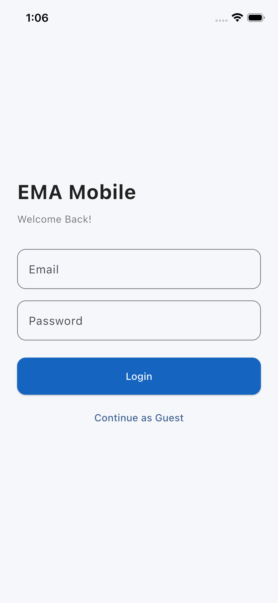
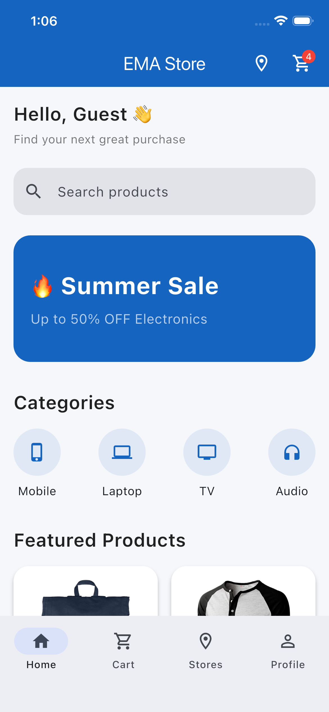
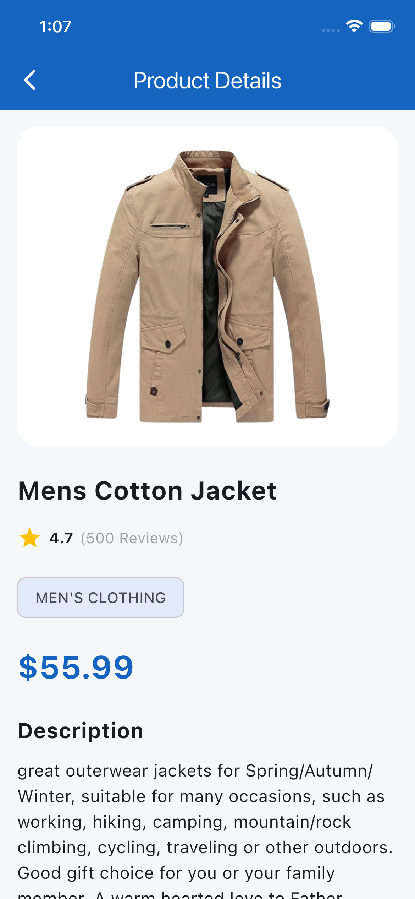
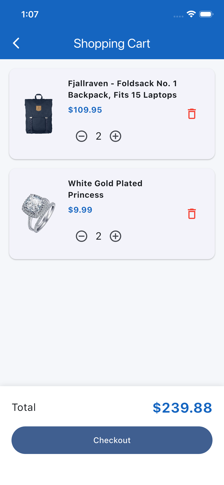
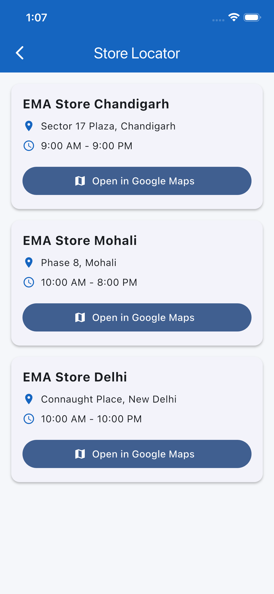

# EMA Store - Flutter Shopping Application

A modern Flutter shopping application developed as part of the **Promotion Mobile Assignment**. The application demonstrates clean architecture, scalable project structure, offline support, state management, and responsive UI development.

---

# Overview

EMA Store is a Flutter-based e-commerce application that allows users to:

- Browse products
- Search products
- View product details
- Manage a shopping cart
- Locate nearby stores
- Continue using the application in offline mode

The project follows Flutter best practices with a feature-based architecture and focuses on maintainability, scalability, and performance.

---

# Features

## Authentication

- Login screen
- Continue as Guest

## Home

- Product listing
- Search products
- Promotional banner
- Categories section
- Pull-to-refresh

## Product

- Product details
- Product rating
- Add to Cart

## Shopping Cart

- Add products
- Increase quantity
- Decrease quantity
- Remove products
- Total amount calculation
- Persistent cart storage

## Store Locator

- View nearby stores
- Navigation support

## Offline Support

- Product caching using Hive
- Shopping cart persistence
- Cached product images
- Offline product browsing
- Offline product search

---

# Tech Stack

- Flutter
- Dart
- Provider
- Dio
- Hive
- GoRouter
- Cached Network Image

---

# Architecture

The application follows a **Feature-Based Architecture** combined with the **Repository Pattern**.

```
Presentation Layer
│
├── Screens
├── Widgets
└── Providers
        │
        ▼
Repository Layer
        │
 ┌──────┴──────┐
 │             │
REST API    Hive Storage
```

### Architectural Principles

- Feature-based project structure
- Repository Pattern
- Separation of Concerns
- Single Responsibility Principle
- Reusable Widgets
- Offline-first approach

---

# Project Structure

```
lib/
│
├── core/
│   ├── constants/
│   ├── network/
│   ├── router/
│   └── storage/
│
├── features/
│   ├── auth/
│   ├── cart/
│   ├── dashboard/
│   ├── home/
│   ├── products/
│   └── store/
│
└── main.dart
```

---

# State Management

The application uses **Provider** for state management.

Current providers include:

- ProductProvider
- CartProvider

This keeps the business logic separate from the UI and ensures predictable state updates.

---

# Offline Strategy

The application supports offline usage through **Hive**.

### Product Flow

```
Application Launch
        │
        ▼
Fetch Products
        │
 ┌──────┴──────┐
 │             │
API Available  Offline
 │             │
 ▼             ▼
Save to Hive  Load from Hive
        │
        ▼
Display Products
```

### Cart Persistence

The shopping cart is also stored locally using Hive.

Only lightweight data is stored:

- Product ID
- Quantity

On application startup:

1. Products are loaded.
2. Cart is restored.
3. Product IDs are mapped back to ProductModel objects.
4. Cart UI is rebuilt.

---

# API

Products are fetched from:

https://fakestoreapi.com/products

---

# Packages Used

| Package | Purpose |
|----------|---------|
| provider | State management |
| dio | REST API communication |
| hive | Local database |
| go_router | Navigation |
| cached_network_image | Image caching |

---

# Environment

Developed and tested with:

- Flutter 3.35.x
- Dart 3.9.x

---

# How to Run

### Clone the repository

```bash
git clone https://github.com/HarrySaggu7/promotion-mobile-assignment.git
cd promotion-mobile-assignment
```

### Install dependencies

```bash
flutter pub get
```

### Analyze the project

```bash
flutter analyze
```

Expected output:

```
No issues found!
```

### Run the application

```bash
flutter run
```

---

# Screens Included

- Login
- Dashboard
- Home
- Product Details
- Shopping Cart
- Store Locator

---

# Screenshots

## Login



---

## Home



---

## Product Details



---

## Shopping Cart



---

## Store Locator



# Future Enhancements

The following improvements can be added in future versions:

- User Authentication
- Wishlist
- Product Categories API
- Product Pagination
- Payment Gateway Integration
- Push Notifications
- Dark Theme
- Unit Testing
- Widget Testing
- Dependency Injection (GetIt / Riverpod)
- Analytics Integration

---

# Developed By

**Harpreet Singh Saggu**

Promotion Mobile Assignment